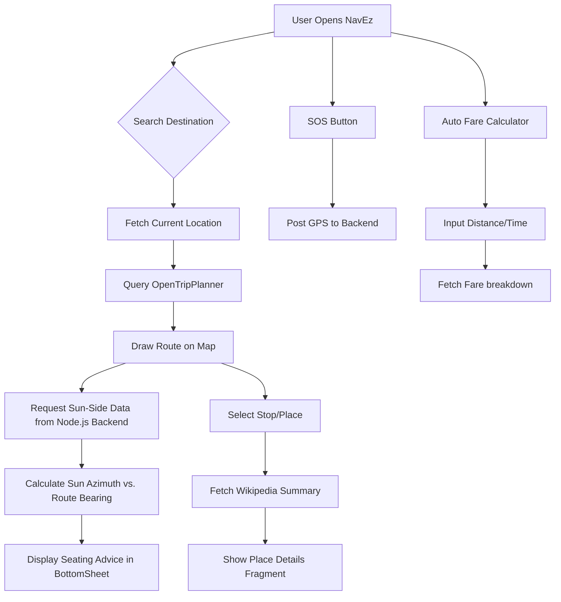

# NavEz - Smart Travel Assistant

NavEz is a modern Android application designed to enhance the public commuting experience. It goes beyond simple navigation by providing "context-aware" travel advice, such as recommending which side of a bus to sit on to avoid direct sunlight, estimating auto-rickshaw fares, and providing emergency SOS features.

## 🚀 Project Overview

The project consists of a Kotlin-based Android application, a Node.js backend for specialized logic (like sun-positioning and fare calculation), and an OpenTripPlanner (OTP) instance for transit routing.

### Key Features
- **Smart Routing**: Integration with OpenTripPlanner to provide accurate bus and transit directions.
- **Sit-in-Shade Recommendation**: A unique algorithm that calculates the sun's position relative to the bus's heading to suggest the most comfortable seating side.
- **Auto Fare Calculator**: Estimates rickshaw fares based on distance, waiting time, and "one-way" or "return" trips.
- **Live Bus Tracking**: Simulated real-time tracking of vehicles on the map.
- **Location Insights**: Fetches and displays Wikipedia summaries for nearby landmarks and transit stops.
- **SOS Emergency Alert**: One-tap emergency notification system that sends location data to the backend.

---

## 🛠 Tech Stack

### Frontend (Android)
- **Language**: Kotlin
- **Map Engine**: MapLibre SDK (Open-source alternative to Google Maps)
- **Networking**: OkHttp, Coroutines
- **UI Components**: Material Design 3, Bottom Sheets, Fragments
- **Location**: Google Play Services (Fused Location Provider)

### Backend
- **Environment**: Node.js, Express.js
- **Database**: PostgreSQL (Store routes and vehicle data)
- **Routing Engine**: OpenTripPlanner (OTP)
- **Utilities**: `SunCalc` (for astronomical calculations)

### Infrastructure
- **Containerization**: Docker & Docker Compose (Orchestrating DB, Backend, and OTP)
- **Data Sources**: OpenStreetMap (OSM) data for routing and reverse geocoding.

---

## 📊 System Workflow

The following flow chart illustrates how different components interact when a user plans a trip:



---

## ⚙️ Project Structure

- `/app`: Android source code (Kotlin).
- `/backend`: Node.js server, sun-positioning logic, and fare algorithms.
- `/otp`: Configuration and data files for the OpenTripPlanner engine.
- `docker-compose.yml`: Orchestration file for the entire ecosystem.

---

## 🛠 Setup and Installation

1. **Infrastructure**: 
   Ensure Docker is installed and run:
   ```bash
   docker-compose up -d
   ```
2. **Backend**:
   Install dependencies in the `backend` folder:
   ```bash
   npm install
   ```
3. **Android**:
   Open the root folder in Android Studio, sync Gradle, and run the app on an emulator or physical device. 
   *Note: Ensure the emulator can access the local backend (usually via `10.0.2.2`).*
